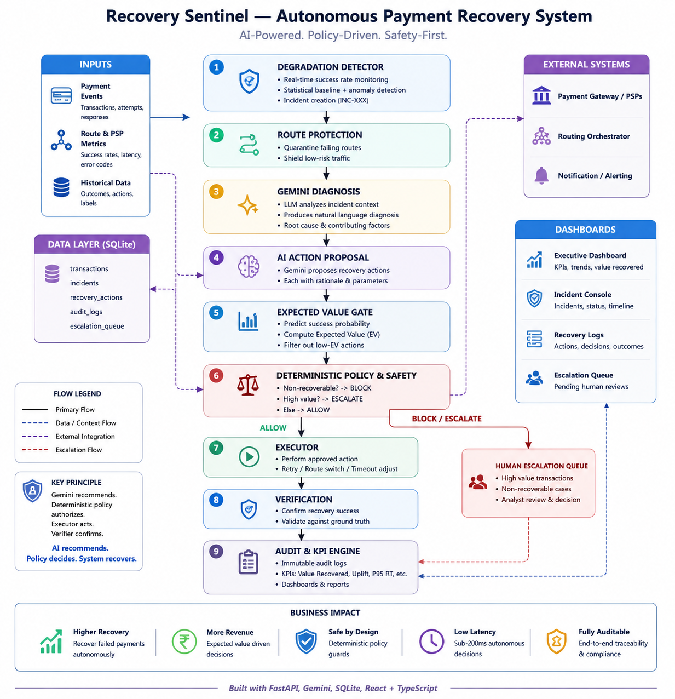

# Recovery Sentinel

Recovery Sentinel is an AI-assisted payment recovery system designed to detect payment-route degradation, protect future traffic, diagnose failure patterns, and safely recover affected transactions.

The system combines Gemini-based diagnosis and recommendations with deterministic financial and safety controls. The AI can recommend an action, but it does not have direct authority to execute one.

---

## What It Does

When a payment route starts failing:

```text
Detect
  ↓
Protect Future Traffic
  ↓
Diagnose Incident
  ↓
AI Recovery Proposal
  ↓
Expected Value Gate
  ↓
Deterministic Policy
  ↓
Execute
  ↓
Verify
  ↓
Audit
  ↓
Evaluate
````

The core principle is:

> **The AI reasons about the case. The policy governs what the system is allowed to do.**

---

## Core Architecture



```text
Payment Stream
      ↓
Degradation Detector
      ↓
Incident
   ↙     ↘
Protect   Recover
Future    Past
Traffic   Transactions
   ↓          ↓
Reroute    Diagnosis
              ↓
        Expected Value Gate
              ↓
       Deterministic Policy
          ↙    ↓     ↘
       RETRY  LINK  STOP / ESCALATE
              ↓
          Execution
              ↓
          Verification
              ↓
       Audit + Metrics
              ↓
          Dashboard
```

---

## Product Story

Recovery Sentinel is designed around a simple sequence:

1. Detect a systemic payment degradation.
2. Identify the affected transactions and revenue at risk.
3. Protect future traffic by shifting away from an unhealthy route.
4. Use AI to diagnose the incident and recommend a bounded action.
5. Calculate expected recovery value before intervention.
6. Apply deterministic policy and safety constraints.
7. Execute only approved actions.
8. Verify the result before counting a recovery.
9. Record the decision and outcome in the audit trail.
10. Evaluate the recovery against a blind-retry baseline.

This separates **reasoning** from **financial authority**.

---

## AI Role vs Deterministic Control

### Gemini is used for

* incident diagnosis
* failure-pattern reasoning
* recovery recommendations
* human-readable reasoning

### Deterministic code controls

* approved action space
* recovery eligibility
* retry limits
* expected-value checks
* high-value escalation
* non-recoverable handling
* already-paid handling
* idempotency
* execution
* verification

Allowed actions are:

```text
RETRY
PAYMENT_LINK
STOP
ESCALATE
```

The LLM cannot directly call payment APIs, execute financial actions, bypass policy, or modify safety thresholds.

When Gemini is unavailable or produces unusable output, the system falls back to deterministic category policy.

---

## Demo Incident

The synthetic demo contains a degraded payment route:

```text
Route: ROUTE_B
Payment method: UPI

Baseline success rate: 96.5%
Observed success rate: 31.25%

Affected transactions: 48
Revenue at risk: ₹12,21,874
```

The route protection layer demonstrates:

```text
ROUTE_B → ROUTE_C
Duration: 15 minutes
```

This protects future traffic while the affected transactions are handled separately.

---

## Recovery Results

For the current synthetic incident:

```text
Affected transactions: 48
Successful recoveries: 46
Verified recoveries: 46

Actions executed: 46
Escalated: 2
Stopped: 0

Revenue at risk: ₹12,21,874
Revenue recovered: ₹11,87,354

Recovery rate: 97.17%
Unsafe executions: 0
```


---

## Counterfactual Baseline

Recovery Sentinel includes an apples-to-apples comparison against a simple blind-retry strategy.

### Recovery Sentinel

```text
Recovered revenue: ₹11,87,354
Intervention attempts: 46
Recovery rate: 97.17%
```

### Blind Retry

```text
Recovered revenue: ₹8,31,953
Intervention attempts: 48
Recovery rate: 68.09%
```

### Result

```text
₹3,55,401 more revenue recovered
29.08 percentage-point higher recovery rate
2 fewer intervention attempts
```

The purpose of the comparison is not to claim more recovered revenue on this particular synthetic dataset.

The value demonstrated here is **restraint**: the system reaches the same recovered revenue while avoiding interventions that its safety logic considers inappropriate.

---

## Safety Policy

Safety is implemented as product logic rather than documentation only.

### Action allow-list

Only these actions can reach the execution layer:

```text
RETRY
PAYMENT_LINK
STOP
ESCALATE
```

### Expected-value gate

The system calculates expected recovery value before intervention:

```text
Expected value
=
recovery probability × transaction amount
-
intervention cost
```

Non-positive expected value does not proceed to autonomous recovery.

### Retry limit

```text
Maximum retries: 2
```

Additional retry attempts are blocked.

### High-value gate

```text
Transaction >= ₹50,000
        ↓
Human escalation
```

### Already-paid protection

A transaction already marked successful is stopped rather than retried.

### Non-recoverable protection

Non-recoverable transactions cannot be autonomously retried or redirected through a recovery action.

### Idempotency

Recovery attempts use a unique transaction + attempt key so duplicate execution is blocked.

### Unknown failures

Unknown failure categories use a safe deterministic fallback and escalate rather than inventing an executable action.

### LLM failure

If Gemini is unavailable or its output cannot be used safely, the system falls back to deterministic category policy.

---

## Safety Demonstrations

The repository includes explicit safety edge-case checks.

### Invalid action

```text
AI proposal: invalid action
Policy: BLOCK
Final action: ESCALATE
```

### Already paid

```text
Transaction: already successful
Policy: STOP
Final action: STOP
```

### Retry limit

```text
Retry count: 2
Policy: BLOCK
Final action: ESCALATE
```

### Non-recoverable transaction

```text
Transaction: NON-RECOVERABLE
Policy: BLOCK
Final action: STOP
```

### High-value transaction

```text
Transaction amount: ₹100,000
Policy: ESCALATE
Final action: ESCALATE
```

### Negative expected value

```text
Expected value <= 0
Policy: STOP
Final action: STOP
```

### Unknown failure

```text
Unknown failure
Deterministic fallback: ESCALATE
```

### Duplicate action

```text
First execution: EXECUTED
Second execution: BLOCKED
Reason: duplicate / idempotency violation
```

---

## Evaluation

The evaluation layer measures:

* affected transactions
* revenue at risk
* revenue recovered
* recovery rate
* successful recoveries
* verified recoveries
* stopped transactions
* escalations
* executed actions
* unsafe executions
* blind-retry comparison
* unnecessary intervention attempts

The system uses synthetic transactions so that the same ground truth can be replayed and evaluated consistently.

---

## Synthetic Dataset

The repository uses a deterministic synthetic dataset containing:

```text
500 transactions
```

The data contains healthy traffic, a transition period, an injected degradation window, and a return toward baseline.

The degradation scenario is centered around:

```text
ROUTE_B + UPI
```

The dataset provides ground-truth recovery labels so that recovery strategies can be evaluated reproducibly.

All monetary results shown by the demo are based on this synthetic data.

---

## Demo Flow

The dashboard provides a **Replay Incident** flow.

```text
Reset Demo
   ↓
Detect Degradation
   ↓
Protect Future Traffic
   ↓
Diagnose Incident
   ↓
Generate Recovery Decisions
   ↓
Apply Deterministic Policy
   ↓
Execute Allowed Actions
   ↓
Verify Recovery
   ↓
Resolve Incident
   ↓
Refresh Dashboard
```

The flow is reproducible from the UI using the **Replay Incident** button.

---

## Dashboard

The dashboard presents a single incident-centric recovery story.

It includes:

* incident state
* baseline vs observed success rate
* revenue at risk
* revenue recovered
* recovery rate
* affected transactions
* escalations
* success-rate timeline
* future-route protection
* recovery activity
* AI action recommendations
* expected values
* policy decisions
* execution outcomes
* activity feed
* audit trail
* blind-retry comparison

The dashboard uses live data from the FastAPI backend after replay.

---

## Project Structure

```text
recovery-sentinel/
├── backend/
│   ├── action_proposer.py
│   ├── audit.py
│   ├── database.py
│   ├── detector.py
│   ├── diagnosis.py
│   ├── evaluation.py
│   ├── executor.py
│   ├── main.py
│   ├── metrics.py
│   ├── policy.py
│   ├── recovery_pipeline.py
│   ├── reset.py
│   ├── route_protection.py
│   ├── value_gate.py
│   └── verifier.py
│
├── data/
│   └── transactions.csv
│
├── docs/
│   └── architecture.png
│
├── frontend/
│   ├── src/
│   ├── package.json
│   └── package-lock.json
│
├── scripts/
│   ├── demo_scenarios.py
│   ├── import_data.py
│   ├── reset_demo.py
│   ├── setup_demo.py
│   ├── test_action_proposer.py
│   ├── test_diagnosis.py
│   ├── test_evaluation.py
│   ├── test_executor.py
│   ├── test_metrics.py
│   ├── test_policy.py
│   ├── test_policy_edge_cases.py
│   ├── test_route_protection.py
│   ├── test_safety_demo.py
│   ├── test_safety_edge_cases.py
│   └── test_verification.py
│
├── tests/
│   └── test_detector.py
│
├── .env.example
├── .gitignore
├── README.md
└── requirements.txt
```

---

## Quick Start

Clone the repository:

```bash
git clone https://github.com/Abhinav-Siddharth/recovery-sentinel.git
cd recovery-sentinel
```

Create the Python environment:

```bash
python3 -m venv .venv
source .venv/bin/activate
```

Install backend dependencies:

```bash
pip install -r requirements.txt
```

Configure the Gemini API key in a local `.env` file:

```env
GEMINI_API_KEY=your_gemini_api_key_here
```

Do not commit the `.env` file.

---

## Initialize the Demo

The easiest way to prepare the synthetic demo is:

```bash
python -m scripts.setup_demo
```

This:

1. creates the SQLite schema
2. imports the 500 synthetic transactions
3. detects the degraded route
4. prepares the demo incident

Expected output:

```text
==================================================
RECOVERY SENTINEL — DEMO SETUP
==================================================

Importing synthetic transactions...
Imported 500 transactions.

Running degradation detector...
DEGRADATION DETECTED: INC-001

Transactions loaded: 500

Demo setup complete.
```

---

## Start the Backend

From the project root:

```bash
uvicorn backend.main:app --reload
```

The FastAPI server runs at:

```text
http://127.0.0.1:8000
```

Interactive API documentation:

```text
http://127.0.0.1:8000/docs
```

---

## Start the Frontend

Open a second terminal:

```bash
cd frontend
npm install
npm run dev
```

The frontend runs at:

```text
http://localhost:5173
```

---

## API

Main endpoints:

```text
GET  /api/health
GET  /api/incident
GET  /api/metrics
GET  /api/evaluation
GET  /api/transactions
GET  /api/audit
GET  /api/safety-demo

POST /api/detect
POST /api/reset
POST /api/recover
```

---

## Testing

Run the detector tests:

```bash
PYTEST_DISABLE_PLUGIN_AUTOLOAD=1 python -m pytest -q tests
```

Expected:

```text
2 passed
```

Run the safety edge-case checks:

```bash
python -m scripts.test_safety_edge_cases
```

Expected:

```text
PASS  invalid action → BLOCK → ESCALATE
PASS  already paid → STOP
PASS  retry limit → BLOCK → ESCALATE
PASS  non-recoverable → BLOCK → STOP
PASS  high-value → ESCALATE
PASS  negative EV → STOP
PASS  unknown failure → ESCALATE
PASS  Gemini/API failure fallback → RETRY
PASS  duplicate attempt → BLOCKED

ALL SAFETY EDGE CASES PASSED
```

Run the deterministic demo scenarios:

```bash
python -m scripts.demo_scenarios
```

Run the evaluation:

```bash
python -m scripts.test_evaluation
```

---

## Frontend Production Build

To verify the production frontend:

```bash
cd frontend
npm run build
```

A successful build produces the Vite production bundle.

---

## Reproducibility

The project is designed so that a fresh clone can be initialized without manually editing the SQLite database.

Use:

```bash
python -m scripts.setup_demo
```

Then start the backend and frontend.

The synthetic dataset, deterministic policy, route-protection logic, and recovery flow are all designed to produce reproducible demo behavior.

---

## What Is Simulated

This project is a prototype using synthetic data.

The following are simulated:

* payment recovery execution
* routing actions
* recovery outcomes from ground-truth data
* transaction-level recovery results

No real merchant funds are moved.

The project does not claim production payment performance.

---

## Limitations

This prototype intentionally does not implement:

* real production payment processing
* production-grade distributed event processing
* authentication or multi-tenancy
* Kubernetes or complex microservices
* production observability infrastructure
* real merchant settlement
* production routing control
* ML-based anomaly detection
* RAG or fine-tuning
* multi-agent orchestration

The goal is a reproducible demonstration of incident-aware recovery with bounded AI reasoning and deterministic financial controls.

---

## Design Principle

Recovery Sentinel is built around one principle:

> **Use AI for reasoning, but keep financial authority deterministic.**

The system therefore separates:

```text
AI reasoning
      ↓
Recommendation
      ↓
Expected-value gate
      ↓
Deterministic policy
      ↓
Controlled execution
      ↓
Verification
      ↓
Audit + evaluation
```

This makes the recovery workflow bounded, explainable, testable, and reproducible.

---

## Future Work

Potential future extensions include:

* richer anomaly-detection models
* broader baseline comparisons
* production payment-provider integrations
* distributed event processing
* stronger observability
* tamper-evident audit chains
* richer human-review workflows
* production-scale recovery orchestration

These are outside the scope of the current prototype.

---

## Core Takeaway

Recovery Sentinel is not simply a retry mechanism.

It detects systemic payment degradation, maps the incident to affected revenue, protects future traffic, reasons about recovery options, constrains financial actions through deterministic policy, verifies outcomes, and records the complete decision trail.

```text
DETECT
  ↓
UNDERSTAND
  ↓
DECIDE SAFELY
  ↓
ACT WITHIN POLICY
  ↓
VERIFY
  ↓
MEASURE
  ↓
EXPLAIN
```


